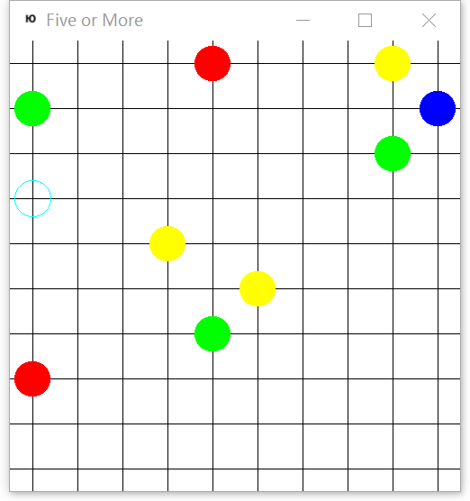

# AlphaFiveormore
Play "Five or More" game with Artificial intelligence

## Features
+ Home-made ["Five or More"](https://wiki.gnome.org/Apps/Five%20or%20more) game
+ Curiosity-driven Exploration by Self-supervised Prediction [1,2]

## Status
GameEngine Debugging... Working on it

## References
1. Pathak, Deepak, et al. "Curiosity-driven exploration by self-supervised prediction." International Conference on Machine Learning (ICML). Vol. 2017. 2017.
2. Achiam, Joshua, and Shankar Sastry. "Surprise-based intrinsic motivation for deep reinforcement learning." arXiv preprint arXiv:1703.01732 (2017).